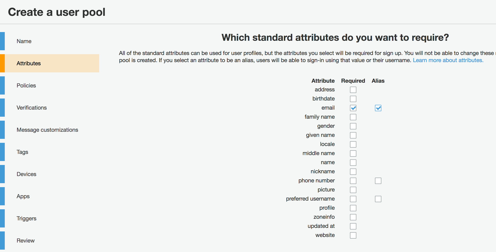

## ハンズオン5:ログイン状態限定のAPIを作る

### Goal
ログインしていないと実行できないAPIを、Cognito UserPoolとServerless Frameworkで作る。

### 0:Cognito UserPoolを作る
STEP4のUserPoolは、「メールアドレスのみでの登録」でした。
今回はユーザー名を指定できるように、あたらしくUserPoolを作り直します。


確認画面にある左側メニューから[Attributes]をクリックし、[email]の[Alias]をオンにします。

それ以外はStep4と同じ手順で作成しましょう。

### 1:サンプルコードをとってくる
一から作ると辛い目にあうのでサンプルコードをとってきます。

```
$ git clone git@github.com:hideokamoto/react-serverless-dashboard.git
$ cd react-serverless-dashboard
$ git checkout hands-on/start
```

### 2:セットアップする

#### ライブラリのインストール
```
$ npm install
```
#### APIのデプロイ
```
$ npm run api-deploy
```
#### Cognito UserPoolの設定
アプリに作成したCognitoの情報を設定します。
```
$ ./.bin/setup.sh
Set app name: `Your Application Name`
Set AWS region: `AWS REGION`
Set Cognito UserPoolId: `AWS Cognito UserPool Id`
Set Cognito UserPool ClientId: `AWS Cognito UserPool Client ID`
Set Your Serverless API url (https://example.execute-api.us-east-1.amazonaws.com/stage/): `Your Serverless API URL`
Create config file on client/cognito.config.js
$ npm run build
```

#### ローカル環境の立ち上げ
```
$ npm start
```

### 3:認証が必要なAPIを作る
ここでは基本的にコピペで作業していきます。
`master`ブランチに完成品がありますので、`git checkout`しながら完成品と動きを比較してみてください。

#### serverless.yml
まずどんな作業をするのかを見るために、serverless.ymlから変更します。
```
provider:
  iamRoleStatements:
    - Effect: "Allow"
      Action:
        - "*"
      Resource:
        - "arn:aws:cognito-idp:*:*:userpool/*"
functions:
  authorizerFunc:
    handler: authorizer.handler
  private:
    handler: private/yourname.handler
    events:
      - http:
          path: private
          method: get
          integration: lambda
          cors: true
          authorizer:
            name: authorizerFunc
            resultTtlInSeconds: 0
            identitySource: method.request.header.Authorization
```
##### コード解説:LambdaのIAMロール設定
`iamRoleStatements`でLambdaに設定されたIAMのロールをカスタマイズできます。
先の例では、`Cognito IdentityServiceProvider`への全アクセスを許可しています。

特定のCognitoに限定する場合は、以下のようにする
```
provider:
  iamRoleStatements:
    - Effect: "Allow"
      Action:
        - "*"
      Resource:
        - "arn:aws:cognito-idp:{REGION}:{AWS_ACCOUNT_NO}:userpool/{UserPoolId}"
```

##### コード解説:APIへの認証の設定
`authorizerFunc`という認証のためのLambda関数を定義しています。  
その後、`http`の設定にて、`authorizer`を追加して、認証に呼び出す関数名と、渡す値を指定しています。  
[より詳しい解説@Qiita](http://qiita.com/horike37/items/7e0984e7729099032930)

```
functions:
  authorizerFunc:
    handler: authorizer.handler
  private:
    handler: private/yourname.handler
    events:
      - http:
          path: private/yourname
          method: get
          integration: lambda
          cors: true
          authorizer:
            name: authorizerFunc
            resultTtlInSeconds: 0
            identitySource: method.request.header.Authorization
```

#### api/private/yourname.js
続いて認証後にアクセスできるAPIのコードを実装します。
今回のコードで認証に成功している場合、`event.principalId`にユーザー名が入ります。
ということでこのAPIはリクエストすると、ログインしているユーザー名をレスポンスする内容になっています。

```
module.exports.handler = (event, context, callback) => {
  if (event.principalId === 'undefined') {
    return callback(new Error('Not authorized.'))
  }
  const message = `Hi! Your username is "${event.principalId}". enjoy!`
  const response = {message}

  return callback(null, response)
}
```

#### api/authorizer.js
認証用のLambdaで実行するコードを貼り付けます。
`YOUR_COGNITO_USERPOOL_REGION`には自分の作成したUserPoolのリージョンを入れてください。
```
'use strict'
const aws = require('aws-sdk')
const cognitoidentityserviceprovider = new aws.CognitoIdentityServiceProvider({
  'apiVersion': '2016-04-18',
  'region': 'YOUR_COGNITO_USERPOOL_REGION'
})

module.exports.handler = (event, context, cb) => {
  const params = {'AccessToken': event.authorizationToken}

  cognitoidentityserviceprovider.getUser(params, (err, data) => {
    if (err) {
      return cb(generatePolicy('user', 'Deny', event.methodArn))
    }

    return cb(null, generatePolicy(data.Username, 'Allow', event.methodArn))
  })
}

function generatePolicy (principalId, effect, resource) {
  const authResponse = {principalId}

  if (effect && resource) {
    const policyDocument = {
      'Statement': [],
      'Version': '2012-10-17'
    }

    const statementOne = {
      'Action': 'execute-api:Invoke',
      'Effect': effect,
      'Resource': resource
    }

    policyDocument.Statement[0] = statementOne
    authResponse.policyDocument = policyDocument
  }

  return authResponse
}
```

手続きとしては、
- APIから送られてきたアクセストークンを使ってCognitoに一致するユーザーが存在するかを確認。
- APIがリクエスト処理するためのpolicyDocumentを付与
という流れです。

#### APIデプロイ
コードが用意できたらデプロイします。
```
$ npm run api-deploy
```

#### APIにアクセスしてみる
curlで`private/yourname`にアクセスするとエラーになるはずです。
これはリクエストヘッダーに正しい`AccessToken`が送られていないため、認証に失敗しているからです。

### 4:認証が必要なAPIにアクセスする
ということでアプリ側で`AccessToken`を送るようにします。

#### client/handlers/serverless.js
CognitoのSDKから`getCurrentUserSession()`を実行すると、`AccessToken`の値が取れます。
取得処理をよしなにラッパーした`Auth.getAuthStatus()`という関数を用意しているので、それを呼び出します。
呼び出した後は、HTTPリクエストを送信するライブラリ(今回はsuperagent)を使って、リクエストヘッダーに取得した値をつけるようにします。

```
  getPrivate (endpoint) {
    return new Promise((resolve, reject) => {
      Auth.getAuthStatus().then((result) => {
        if (result === 'Unauthorized') {
          reject(result)
        } else {
          const sessionId = result

          request.get(endpoint)
            .set('Authorization', sessionId)
            .end((err, response) => {
              if (err) {
                reject(err)
              }
              resolve(response)
            })
        }
      })
    })
  }
```
#### client/home/home.js
APIを呼び出すための関数を作れたので、実際に呼び出す処理を付け足します。
Reactならではの処理がまざってるので、Reactに興味がある人以外はあまり深く考えないでください。

```
handleUsername (event) {
  event.preventDefault()
  this.setState({'username': 'loading...'})
  API.getPrivate(`${apiBase}yourname`)
  .then((result) => {
    this.setState({'username': result.body.message})
  })
  .catch((err) => {
    console.log(err)
  })
}
```

#### ビルド
```
$ npm run build
$ npm start
```
ログイン後に出る「Get your username」ボタンを押すとユーザー名が取れる
